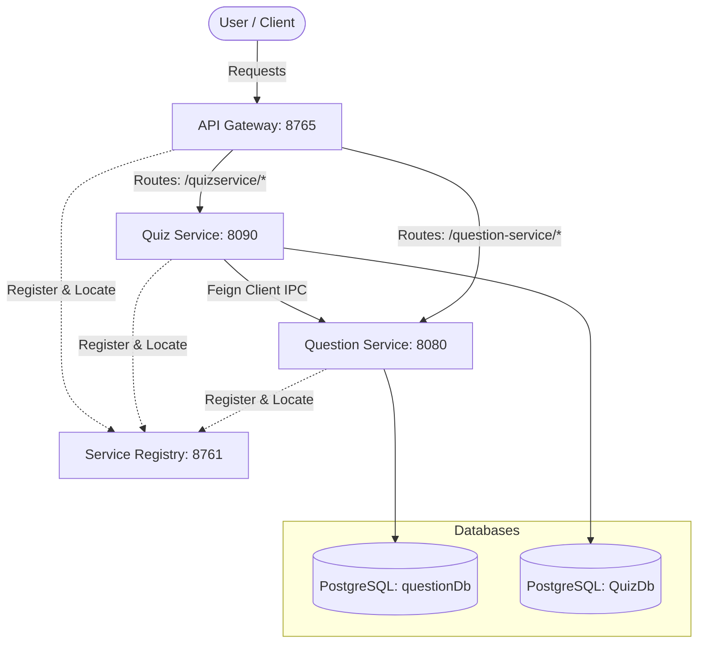

# 🧠 Microservice Quiz Application

A robust, scalable, and decentralized Quiz Application built using the **Spring Boot Microservices architecture**. The system is composed of multiple independent services that register with a Eureka discovery server, route requests via a Spring Cloud API Gateway, and communicate with each other using OpenFeign clients.

---

## 🛠️ Tech Stack & Technologies

The application is built using modern, production-ready enterprise technologies:


### Backend Services
* **Language & Runtime**: **Java 21 (LTS)**
* **Framework**: **Spring Boot 4.0.6**
* **Service Registry & Discovery**: **Spring Cloud Netflix Eureka Server**
* **API Gateway**: **Spring Cloud Gateway** (dynamic service locator routing)
* **Inter-Service Communication**: **Spring Cloud OpenFeign** (declarative HTTP clients)

### Persistence & Utilities
* **Database**: **PostgreSQL** (highly stable relational DB engines)
* **ORM**: **Spring Data JPA & Hibernate** (automatic database schema generation/updates)
* **Boilerplate Reduction**: **Project Lombok** (`@Data`, `@NoArgsConstructor`, `@RequiredArgsConstructor`)
* **Build System**: **Maven Wrapper (mvnw)**

---


## 🏗️ Architecture Overview

The system architecture is structured to separate concerns between question management (CRUD, scoring, wrappers) and quiz lifecycle management (quiz creation, retrieval, submissions).

### System Topology



---

## ⚙️ Service Catalog

| Service Name | Port | Database | Role & Description |
| :--- | :---: | :--- | :--- |
| **ServiceRegistry** | `8761` | None | **Netflix Eureka Server** that acts as the discovery service. All services register here to resolve other services dynamically. |
| **ApiGateway** | `8765` | None | **Spring Cloud Gateway** serving as the single entry point. Handles routing, security, and load balancing across services. |
| **Question-Service** | `8080` | `questionDb` | Manages the repository of questions (CRUD operations), generates random question sets, and evaluates responses to compute scores. |
| **QuizService** | `8090` | `QuizDb` | Manages quizzes, associates them with lists of question IDs, fetches question details dynamically, and calculates final grades. |

---

## 🛠️ Prerequisites & Setup

### Prerequisites
- **Java Development Kit (JDK) 21**
- **Apache Maven 3.9+**
- **PostgreSQL Database** running on `localhost:5432`

### Database Setup
1. Create two separate databases in PostgreSQL:
   ```sql
   CREATE DATABASE "questionDb";
   CREATE DATABASE "QuizDb";
   ```
2. By default, both services are configured to connect to PostgreSQL with credentials defined in their respective `application-local.properties` files:
   - **Username**: `postgres`
   - **Password**: `Shivang12072003`

If you need to change the credentials, update:
- `Question-Service/src/main/resources/application-local.properties`
- `QuizService/src/main/resources/application-local.properties`

---

## 🚀 How to Run the Application

To start the system, launch the services in the following order:

### 1. Start Service Registry
```bash
cd ServiceRegistery
./mvnw spring-boot:run
```
*Verify Eureka is live at `http://localhost:8761`.*

### 2. Start Question Service
```bash
cd ../Question-Service
./mvnw spring-boot:run
```

### 3. Start Quiz Service
```bash
cd ../QuizService
./mvnw spring-boot:run
```

### 4. Start API Gateway
```bash
cd ../ApiGateway
./mvnw spring-boot:run
```

Once all services are up, they will register themselves with Eureka and become accessible through the API Gateway on port `8765`.

---

## 📡 API Reference & Endpoints

You can interact with the microservices directly or through the **API Gateway (Port 8765)**.

### 1. Question Service Endpoints
*(Gateway Path: `http://localhost:8765/question-service/...` | Direct Path: `http://localhost:8080/...`)*

#### 🔹 Get All Questions
* **Method & URL**: `GET /question/allQuestions`
* **Response Body**:
  ```json
  [
    {
      "id": 1,
      "questionTitle": "What is the return type of the hashCode() method in the Object class?",
      "option1": "int",
      "option2": "Object",
      "option3": "long",
      "option4": "void",
      "rightAnswer": "int",
      "difficultylevel": "Easy",
      "category": "Java"
    }
  ]
  ```

#### 🔹 Get Questions by Category
* **Method & URL**: `GET /question/category/{categoryName}`
* **Example**: `/question/category/Java`

#### 🔹 Add a Question
* **Method & URL**: `POST /question/add`
* **Request Body**:
  ```json
  {
    "questionTitle": "Which keyword is used to define a constant in Java?",
    "option1": "const",
    "option2": "final",
    "option3": "static",
    "option4": "immutable",
    "rightAnswer": "final",
    "difficultylevel": "Easy",
    "category": "Java"
  }
  ```

#### 🔹 Generate Quiz Question IDs (Internal API)
* **Method & URL**: `GET /question/generate?categoryName={category}&numQuestions={count}`

#### 🔹 Get Question Wrappers by IDs (Internal API - Hides Right Answers)
* **Method & URL**: `POST /question/getQuestions`
* **Request Body**: `[1, 2, 3]`

#### 🔹 Calculate Score (Internal API)
* **Method & URL**: `POST /question/getScore`
* **Request Body**:
  ```json
  [
    { "id": 1, "response": "int" },
    { "id": 2, "response": "final" }
  ]
  ```

---

### 2. Quiz Service Endpoints
*(Gateway Path: `http://localhost:8765/quizservice/...` | Direct Path: `http://localhost:8090/...`)*

#### 🔹 Create a Quiz
* **Method & URL**: `POST /quiz/create`
* **Request Body (`QuizDto`)**:
  ```json
  {
    "categoryName": "Java",
    "numQuestions": 5,
    "title": "Java Basics Quiz"
  }
  ```

#### 🔹 Fetch Quiz Questions (For Users - Right Answers Hidden)
* **Method & URL**: `GET /quiz/get/{id}`
* **Response Body (`List<QuestionWrapper>`)**:
  ```json
  [
    {
      "id": 1,
      "questionTitle": "What is the return type of the hashCode() method in the Object class?",
      "option1": "int",
      "option2": "Object",
      "option3": "long",
      "option4": "void"
    }
  ]
  ```

#### 🔹 Submit Quiz & Get Score
* **Method & URL**: `POST /quiz/submit/{id}`
* **Request Body**:
  ```json
  [
    { "id": 1, "response": "int" },
    { "id": 2, "response": "final" }
  ]
  ```
* **Response**: `2` (Integer representing the score)

---

## 🔗 Inter-Service Communication Flow

When a user interacts with the `QuizService` to participate in a quiz, the services communicate using **Spring Cloud OpenFeign**:

1. **Quiz Creation**:
   * Client sends a request to `QuizService` to create a quiz (`POST /quiz/create`).
   * `QuizService` uses OpenFeign (`QuizInterface`) to invoke `/question/generate` on `Question-Service`.
   * `Question-Service` fetches random IDs for the category from `questionDb` and returns them.
   * `QuizService` stores the quiz details (ID, Title, and list of Question IDs) in `QuizDb`.

2. **Taking the Quiz**:
   * Client requests quiz questions (`GET /quiz/get/{id}`).
   * `QuizService` retrieves the stored list of question IDs from `QuizDb`.
   * `QuizService` makes a Feign call to `/question/getQuestions` on `Question-Service` to fetch safe wrappers (`QuestionWrapper` without answers) for those IDs.
   * Client receives the question list.

3. **Submitting the Quiz**:
   * Client submits answers (`POST /quiz/submit/{id}`).
   * `QuizService` fetches the quiz details from `QuizDb`.
   * `QuizService` forwards the submitted user responses to `Question-Service` via the Feign endpoint `/question/getScore`.
   * `Question-Service` compares responses against `rightAnswer` in `questionDb` and returns the final score.